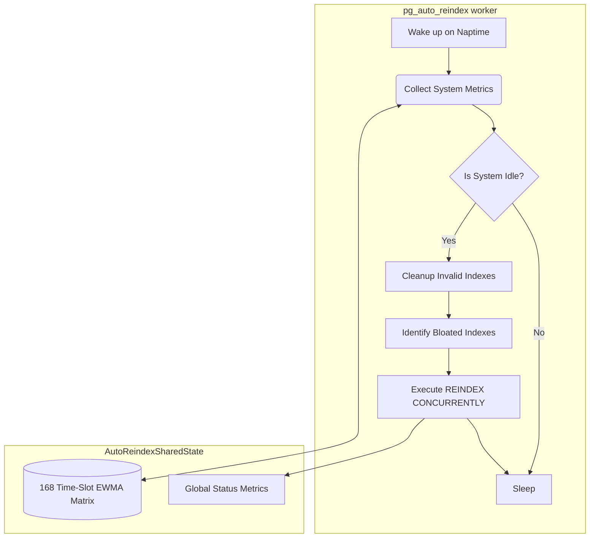

# pg_auto_reindex: Technical Design Document

## 1. Overview
### Goals
`pg_auto_reindex` is a PostgreSQL extension designed to automatically and autonomously manage B-Tree index bloat. Its primary goals are to detect when the database system is idle, identify heavily bloated indexes, and safely execute `REINDEX CONCURRENTLY` without impacting the performance of active workloads.

### Problem Statement
In PostgreSQL, heavily updated tables often suffer from index bloat, leading to decreased query performance and increased storage costs. While autovacuum helps, it does not shrink indexes. Administrators typically have to rely on external cron jobs or manual intervention to reindex, which can inadvertently disrupt peak traffic or cause lock pile-ups. 

### Design Philosophy
1. **Autonomous & Adaptive**: Learn the database's historical workload patterns to identify true idle windows, rather than relying on static schedules.
2. **Low Overhead**: Use fast, metadata-based estimations for bloat rather than scanning the actual index pages (e.g., using `pgstattuple`).
3. **Safety First**: Reindexing must be non-blocking (`CONCURRENTLY`), respect lock timeouts to avoid blocking other transactions, and be able to heal gracefully if a failure leaves behind invalid `_ccnew` indexes.

## 2. Architecture
The extension operates as a Background Worker that periodically samples system metrics and manages a stateful learning matrix in shared memory.

### Background Worker Architecture



### Shared Memory Layout
The shared memory (`AutoReindexSharedState`) stores:
- **LWLock**: `lock` for synchronizing access.
- **State**: Current system idle status (`is_idle`) and consecutive idle samples (`consecutive_idle_count`).
- **Learning Matrix**: An array of 168 `SlotStats` structs (7 days * 24 hours), storing the EWMA (Exponentially Weighted Moving Average) of CPU load and active backends.
- **Global Metrics**: Current reindexing OID, last reindex time, total reindexes, and total bytes saved.

## 3. Core Modules

### 3.1 Idle Learner
- **168 Time-Slot EWMA Algorithm**: The week is divided into 168 one-hour slots (0-167). For each slot, the system maintains an EWMA of CPU load and active backend counts using a smoothing factor (`EWMA_ALPHA = 0.20`).
- **Metric Collection**: At each `pg_auto_reindex.naptime` interval, the worker samples the 1-minute CPU load average (`getloadavg()`) and the number of active backends via `pg_stat_activity`.
- **Idle Detection**: 
  - **Absolute Threshold**: Current load and backends must be below `max_idle_load` and `max_idle_backends`.
  - **Relative Threshold**: Current load and backends must be less than or equal to the historical EWMA for the current time slot multiplied by `idle_ratio_threshold`.
  - **Hysteresis**: To prevent flapping, the system requires 3 consecutive idle samples to confirm an `IDLE` state.

### 3.2 Bloat Estimator
- **Metadata-Based Formula**: Instead of expensive relation scans, it uses `pg_class` (pages, tuples) and `pg_statistic` (average column widths) to estimate B-Tree bloat.
- **SQL Query Design**: It filters for valid B-Tree indexes (`indisvalid = true`), excluding system catalogs. It filters by user-defined GUC thresholds (`min_bloat_bytes` and `min_bloat_ratio`) and sorts the candidates by the absolute number of estimated bloated bytes descending, prioritizing the most wasteful indexes.

### 3.3 Reindex Executor
- **Workflow**: Retrieves top `N` candidates (`max_reindexes_per_idle`).
- **Lock Timeout Protection**: Before executing, it sets `lock_timeout = '<guc_lock_timeout_ms>ms'` to ensure `REINDEX CONCURRENTLY` does not queue up and block other queries waiting for AccessExclusiveLocks.
- **Error Handling**: Uses `PG_TRY()` / `PG_CATCH()` to trap errors (such as lock timeouts or deadlocks) safely, logging the failure without crashing the background worker.
- **Invalid Index Self-Healing**: Failed `REINDEX CONCURRENTLY` commands can leave behind invalid indexes (often suffixed with `_ccnew`). The worker automatically detects these and cleans them up (`DROP INDEX CONCURRENTLY IF EXISTS`) before starting a new reindex cycle.

### 3.4 Audit Log
All reindex operations are logged into the `pg_auto_reindex_history` table:
- `schemaname`, `indexname`
- `start_time`, `end_time`
- `bytes_before`, `bytes_after`, `bytes_saved` (Generated)
- `status` ('SUCCESS' or 'TIMEOUT')
- `created_at` (Timestamp when audit record is created, default `now()`)

## 4. GUC Parameters

| Parameter | Type | Default | Range | Description |
| :--- | :--- | :--- | :--- | :--- |
| `pg_auto_reindex.enabled` | bool | `true` | - | Enable or disable automatic index reindexing. |
| `pg_auto_reindex.database` | string | `'postgres'` | - | Target database for auto reindex background worker. |
| `pg_auto_reindex.naptime` | int | `60` | 1 - 3600 | Sampling interval in seconds. |
| `pg_auto_reindex.idle_ratio_threshold` | real | `0.70` | 0.10 - 1.00 | Threshold ratio of current load vs historical EWMA to consider idle. |
| `pg_auto_reindex.max_idle_load` | real | `2.0` | 0.1 - 100.0 | Maximum 1-min CPU load average allowed for idle state. |
| `pg_auto_reindex.max_idle_backends` | int | `15` | 0 - 1000 | Maximum active backends allowed for idle state. |
| `pg_auto_reindex.min_bloat_ratio` | real | `0.30` | 0.05 - 0.99 | Minimum estimated bloat ratio to trigger reindex. |
| `pg_auto_reindex.min_bloat_bytes` | int64 | `67108864` | - | Minimum estimated bloat bytes (default 64MB) to trigger reindex. |
| `pg_auto_reindex.lock_timeout_ms` | int | `5000` | 100 - 300000 | Lock timeout in milliseconds during REINDEX CONCURRENTLY. |
| `pg_auto_reindex.max_reindexes_per_idle` | int | `2` | 1 - 100 | Maximum indexes reindexed per idle window. |

## 5. SQL Function API
- `pg_auto_reindex_stats()`: Returns a set of records showing the 168 time-slot EWMA statistics (load, active backends, etc.).
- `pg_auto_reindex_bloat_report()`: Evaluates the system using the configured GUCs and returns a set of indexes that currently qualify for reindexing, along with their estimated bloat.
- `pg_auto_reindex_status()`: Returns a single record detailing the background worker's current state (idle status, current index being processed, total bytes saved, etc.).
- `pg_auto_reindex_trigger()`: Manually invokes the invalid index cleanup and auto-reindex cycle immediately, bypassing the idle checks. Returns boolean true.

## 6. Installation & Usage
### Build & Install
Ensure `pg_config` is in your PATH. Run the standard extension compilation commands:
```bash
make
make install
```

### Configure
Add the library to `shared_preload_libraries` in `postgresql.conf` so the background worker can launch and allocate shared memory:
```ini
shared_preload_libraries = 'pg_auto_reindex'
```
Restart PostgreSQL for the changes to take effect.

### Enable
Connect to the database configured in `pg_auto_reindex.database` and create the extension to instantiate the audit tables and SQL functions:
```sql
CREATE EXTENSION pg_auto_reindex;
```

## 7. Safety Design
- **Lock Timeout Protection**: Standard `REINDEX` can block queries. `pg_auto_reindex` strictly uses `CONCURRENTLY` coupled with a dynamic `SET lock_timeout` prior to execution. If acquiring the necessary locks takes longer than the timeout, the statement gracefully fails without creating lock queues.
- **Transaction Isolation**: System metrics collection and reindex execution are carefully separated into discrete, short-lived transactions. The worker ensures `SPI_connect()` and active snapshots are properly pushed and popped, committing immediately to prevent long-running transactions that could inhibit autovacuum.
- **Error Recovery**: The use of `PG_TRY` and `PG_CATCH` around DDL execution ensures that backend exceptions do not crash the autonomous worker. The extension guarantees robustness by self-healing `_ccnew` indexes left by failed concurrent reindexes.

## 8. Bloat Estimation Formula
The estimation heavily leverages catalog metadata to avoid reading index data blocks directly.

**Variables:**
- `relpages`: Number of 8KB pages in the index (`pg_class`).
- `reltuples`: Number of rows in the index (`pg_class`).
- `avg_width`: Sum of the average widths of indexed columns (`pg_statistic`).

**Derivation:**
1. **Tuple Size**: Each index tuple consists of an 8-byte header plus the actual data width (`COALESCE(avg_width, 16) + 8`).
2. **Page Capacity**: A standard PostgreSQL page is 8192 bytes. Deducting a 64-byte page header leaves `8192 - 64` usable bytes per page.
3. **Ideal Pages**: The minimum number of pages required to store `reltuples` is:
   `Ideal Pages = CEIL( reltuples * Tuple Size / Usable Page Size )`
   We ensure this is at least `1` using `GREATEST(..., 1)`.
4. **Estimated Bloat Ratio**:
   `Bloat Ratio = (relpages - Ideal Pages) / relpages`
5. **Estimated Bloat Bytes**:
   `Bloat Bytes = (relpages - Ideal Pages) * 8192`

This provides a highly efficient $O(1)$ approximation of bloat that scales independently of index size, perfect for frequent background evaluation.
