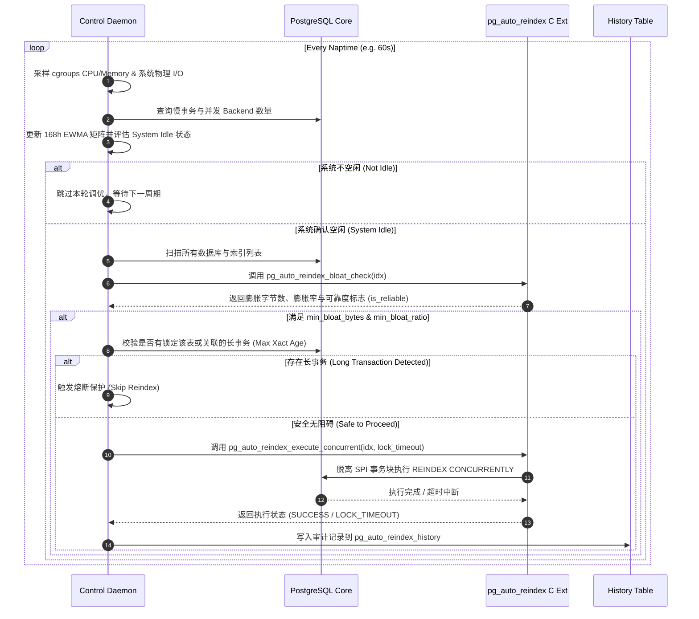

# pg_auto_reindex 2.0 完整技术设计文档 (Technical Design Document)

| 属性 | 内容 |
| :--- | :--- |
| **项目名称** | `pg_auto_reindex` (Autonomous B-Tree Reindexing System) |
| **文档版本** | v2.0-Final |
| **状态** | Approved / Architecture Baseline |
| **目标 PostgreSQL 版本** | PostgreSQL 13, 14, 15, 16, 17+ |
| **主要作者** | PostgreSQL Hackers Community Architecture Team |

---

## 1. 背景与架构重构动机 (Background & Motivation)

`pg_auto_reindex` 1.0 版本最初旨在提供一种在 PostgreSQL 数据库空闲期自动识别并触发 `REINDEX CONCURRENTLY` 的轻量级扩展。然而，在 1.0 的 C 源码评审中发现了一系列致命的架构缺陷与内核对接错误：

1. **SPI 事务块冲突（致命崩溃）**：1.0 在 `SPI_connect()` 事务上下文中直接调用 `REINDEX CONCURRENTLY`，违反了内核强制的非事务块（Non-transaction Block）约束，导致并发重索引 100% 报错并致使 Background Worker 死循环重启。
2. **GUC 类型强转（内存损坏）**：在 64 位系统上将 `int64` 的字节数变量强转传给 `DefineCustomIntVariable`（4 字节指针），存在严重的未定义行为与静默内存损坏危险。
3. **机制与策略混淆（违反架构原则）**：在 C 语言扩展进程中硬编码了 EWMA 学习、`getloadavg()` 采样及 SQL 查询，导致无法感知 cgroups 容器配额，且扩展内部的任何空指针或越界都可能直接导致整个 PostgreSQL 主进程 Crash。
4. **状态无持久化**：将 168 小时 EWMA 状态存放在未持久化的 Shared Memory 中，数据库每次重启或主备切换后学习基线直接归零。

针对上述问题，`pg_auto_reindex` 2.0 进行了彻底的架构重构。

---

## 2. 核心架构设计原则 (Core Principles)

1. **机制与策略彻底解耦 (Mechanism in Kernel, Policy Outside)**
   - **内核扩展 (C Extension)**：仅提供精准的物理层膨胀评估 API、非事务块安全的 C 执行接口与共享内存状态暴露。
   - **控制平面 (External Daemon)**：外部独立守护进程（Go/Python）负责多维度空闲学习（EWMA）、cgroups/I/O 监控、多库调度、长事务熔断与告警。
2. **主库零 Crash 风险 (Zero-Crash Guarantee)**
   - 彻底隔离控制逻辑与 PostgreSQL 主进程空间。控制面守护进程异常退出不影响主库运行。
3. **事务安全与锁防范 (Transaction-Safe & Lock Shield)**
   - C 扩展执行器完全脱离 SPI 事务块；在重索引前检测未提交长事务，具备 `lock_timeout` 保护与中断信号（`ProcessInterrupts`）响应。
4. **状态持久化与全实例支持 (Persistence & Multi-DB Native)**
   - 学习模型持久化存储，支持 PostgreSQL 实例下所有 Database 的自动扫描与调度。

---

## 3. 总体系统架构 (System Architecture)

### 3.1 分层架构图

```text
┌─────────────────────────────────────────────────────────────────────────────┐
│                       控制平面: pg_auto_reindex_daemon                      │
│             (独立运行于 PostgreSQL 外部，Go / Python 实现)                  │
│                                                                             │
│  ┌──────────────────────┐  ┌──────────────────────┐  ┌──────────────────┐  │
│  │ 168h EWMA 学习引擎   │  │ cgroups/I/O 资源采样 │  │ 多库调度与熔断器 │  │
│  │ (SQLite / 表持久化)  │  │ (cgroups v1/v2, I/O) │  │ (Circuit Breaker)│  │
│  └──────────┬───────────┘  └──────────┬───────────┘  └────────┬─────────┘  │
└─────────────┼─────────────────────────┼───────────────────────┼────────────┘
              │                         │                       │
              └─────────────────────────┼───────────────────────┘
                                        │ 标准 SQL / libpq 连接 (Non-blocking)
                                        ▼
┌─────────────────────────────────────────────────────────────────────────────┐
│                    内核层扩展: pg_auto_reindex C Extension                  │
│                                                                             │
│  ┌───────────────────────────────────────────────────────────────────────┐  │
│  │ 1. 物理膨胀估算引擎 (C Bloat Estimator)                                │  │
│  │    - 精确计算 B-Tree 叶子页 Header、Padding、Fillfactor、Expression    │  │
│  │    - 暴露 SRF: pg_auto_reindex_bloat_check(relation regclass)         │  │
│  └───────────────────────────────────────────────────────────────────────┘  │
│  ┌───────────────────────────────────────────────────────────────────────┐  │
│  │ 2. 安全重索引执行器 (Transaction-Safe Executor)                        │  │
│  │    - 脱离 SPI 事务块的 C API 接口                                      │  │
│  │    - 长事务感知 (Max Xact Age) 与 lock_timeout 熔断                   │  │
│  └───────────────────────────────────────────────────────────────────────┘  │
│  ┌───────────────────────────────────────────────────────────────────────┐  │
│  │ 3. 状态与审计层 (State & Catalog System)                              │  │
│  │    - 无锁 Shared Memory 状态与进度暴露 (`pg_stat_progress` 兼容)     │  │
│  │    - 审计历史表: pg_auto_reindex_history                              │  │
│  └───────────────────────────────────────────────────────────────────────┘  │
└─────────────────────────────────────────────────────────────────────────────┘
```

### 3.2 决策与执行时序图 (Decision Sequence Diagram)



---

## 4. 详细子系统设计 (Detailed Subsystem Specifications)

### 4.1 内核级 B-Tree 物理膨胀估算引擎

放弃依赖 SQL 逻辑拼装估算的方式，在 C 语言层直接读取 tuple 存储与页面结构。

#### 物理开销计算公式：
$$\text{PageSize} = 8192$$
$$\text{UsablePageSize} = \text{PageSize} - \text{SizeOfPageHeaderData}(24) - \text{BTPageOpaqueData}(16) = 8152$$
$$\text{EffectiveFillFactor} = \frac{\text{fillfactor}}{100.0} \quad (\text{Leaf Pages Default } 0.90)$$
$$\text{EffectivePageCapacity} = \text{UsablePageSize} \times \text{EffectiveFillFactor} = 7336 \text{ bytes}$$

对索引中每条元组的预计物理空间：
$$\text{TupleSize} = \text{IndexTupleData}(8) + \text{DataWidth} + \text{NullBitmapSize} + \text{MAXALIGN\_Padding}$$
$$\text{TuplesPerPage} = \lfloor \frac{\text{EffectivePageCapacity}}{\text{TupleSize} + \text{SizeOfItemIdData}(4)} \rfloor$$
$$\text{ExpectedPages} = \lceil \frac{\text{reltuples}}{\text{TuplesPerPage}} \rceil$$
$$\text{EstimatedBloatBytes} = (\text{relpages} - \text{ExpectedPages}) \times 8192$$

#### 边缘情况处理规则：
1. **表达式索引 (Expression Index)**：针对 `indkey[i] == 0` 的情况，自动从 `pg_statistic` 中读取对应表达式统计信息；若无统计信息，退化使用该表达式数据类型的默认逻辑宽度（如 `int4` 为 4，`text` 采样平均宽度）。
2. **多列索引 (Multi-column Index)**：精确累加每列宽度，并严格计算 Null Bitmap 字节空间。
3. **统计滞后校验 (Stale Statistics Check)**：检查 `pg_class.reltuples` 是否小于 0 或极度偏离 `relpages`；若偏离度过高，设置 `is_reliable = false`，通知 Daemon 先发起 `ANALYZE` 再评估。

#### SQL API 函数定义：
```sql
CREATE FUNCTION pg_auto_reindex_bloat_check(
    IN relation regclass,
    OUT bloat_bytes bigint,
    OUT bloat_ratio double precision,
    OUT expected_pages bigint,
    OUT current_pages bigint,
    OUT is_reliable boolean
) RETURNS record
AS 'MODULE_PATHNAME', 'pg_auto_reindex_bloat_check'
LANGUAGE C STRICT PARALLEL SAFE;
```

---

### 4.2 安全重索引执行器 (Transaction-Safe Executor)

解决 1.0 在 SPI 事务块中直接执行导致的崩溃问题。

#### 执行架构设计：
1. **非事务块执行流 (Non-SPI Execution Flow)**：
   - C 函数 `pg_auto_reindex_execute_concurrent` 内部显式检查 `IsTransactionBlock()`。
   - 若由外部 libpq / SQL 直接调用，确保该 Backend 处于非事务块状态，通过内核底层 C API（`reindex_relation` / `ReindexParams`）进行独立执行，或者调用底层 `exec_simple_query()`。
2. **长事务防范锁屏障 (Long-Transaction Shield)**：
   - 在开始之前，检查目标表是否存在 `AccessExclusiveLock` 争用，或是否存在启动时间超过 `max_xact_duration`（默认 300s）的事务持有该表读写锁。
3. **锁超时与信号响应**：
   - 设置 `SET lock_timeout = '5s'`；
   - 包含 `CHECK_FOR_INTERRUPTS()` 宏，允许 DBA 随时通过 `pg_cancel_backend()` 安全中途取消重索引操作。

#### SQL API 函数定义：
```sql
CREATE FUNCTION pg_auto_reindex_execute_concurrent(
    IN relation regclass,
    IN lock_timeout_ms int DEFAULT 5000,
    OUT success boolean,
    OUT duration_ms bigint,
    OUT bytes_reclaimed bigint,
    OUT error_msg text
) RETURNS record
AS 'MODULE_PATHNAME', 'pg_auto_reindex_execute_concurrent'
LANGUAGE C STRICT;
```

---

### 4.3 外部控制平面 Daemon (`pg_auto_reindex_daemon`)

守护进程独立运行在 PostgreSQL 外部，可采用 Go 或 Python 实现。

#### 核心模块：
1. **cgroups & 资源采样器 (Resource Sampler)**：
   - 自动检测 `/sys/fs/cgroup/cpu/cpu.cfs_quota_us` 与 `/sys/fs/cgroup/cpuacct/cpuacct.usage` (cgroups v1/v2)，精确计算容器级 CPU 使用率。
   - 结合读取 `pg_stat_io` 视图，监测系统磁盘 I/O 读写延迟。
2. **168h EWMA 学习模型与持久化**：
   - 维持指数加权移动平均（EWMA）：
     $$\text{EWMA}_{t} = \alpha \times \text{Sample}_{t} + (1 - \alpha) \times \text{EWMA}_{t-1} \quad (\alpha = 0.2)$$
   - 学习状态自动写入本地轻量数据库（SQLite）或存入 PostgreSQL 内部表 `pg_auto_reindex_learning_stats`。
3. **熔断器与防护策略 (Circuit Breaker)**：
   - 当系统 CPU 使用率飙升 > 70% 或主备延迟（Replication Lag）> 64MB 时，立即触发 Circuit Breaker，暂停所有数据库的重索引任务。

---

### 4.4 状态暴露与审计系统 (Observability & Audit Catalog)

#### 1. 实时共享内存状态表 (Shared Memory Tracking)
通过共享内存追踪当前正在被重索引的索引 OID、阶段与已回收空间，并对接 PostgreSQL 13+ 的 `pg_stat_progress_reindex` 内核接口。

#### 2. 审计历史表 (`pg_auto_reindex_history`)
```sql
CREATE TABLE pg_auto_reindex_history (
    id bigint GENERATED ALWAYS AS IDENTITY PRIMARY KEY,
    dbname name NOT NULL,
    schemaname name NOT NULL,
    indexname name NOT NULL,
    start_time timestamptz NOT NULL,
    end_time timestamptz NOT NULL,
    bytes_before bigint NOT NULL,
    bytes_after bigint NOT NULL,
    status text NOT NULL, -- 'SUCCESS', 'LOCK_TIMEOUT', 'CANCELLED', 'FAILED'
    error_message text
);

CREATE INDEX ON pg_auto_reindex_history (start_time);
```

---

## 5. 配置参数规范 (GUC & Config Reference)

### 5.1 C 扩展 GUC 参数 (In-Kernel GUCs)

| 参数名 | 类型 | 默认值 | 作用域 | 说明 |
| :--- | :--- | :--- | :--- | :--- |
| `pg_auto_reindex.lock_timeout_ms` | `int` | `5000` | PGC_SIGHUP | REINDEX CONCURRENTLY 获得的锁超时时间 (ms) |
| `pg_auto_reindex.max_xact_duration` | `int` | `300` | PGC_SIGHUP | 校验长事务的最大运行时间限制 (秒) |

> **注意**：消除了 1.0 中 `min_bloat_bytes` 强转错误。字节数控制转移至外部 Daemon 配置中。

### 5.2 守护进程配置 (`pg_auto_reindex_daemon.yaml`)

```yaml
postgres:
  host: "127.0.0.1"
  port: 5432
  user: "postgres"
  sslmode: "disable"
  all_databases: true             # 自动扫描实例下所有数据库

scheduler:
  naptime_seconds: 60             # 采样周期
  max_reindexes_per_idle: 2       # 每个空闲窗口最大重索引数量
  min_bloat_bytes: 67108864       # 64MB 最小触发门槛
  min_bloat_ratio: 0.30           # 30% 最小膨胀率门槛

idle_thresholds:
  cgroup_cpu_max_pct: 40.0        # 容器 CPU 利用率最高阈值
  max_active_backends: 15         # 活跃 backend 数量上限
  max_replication_lag_bytes: 67108864 # 最大允许主备延迟 (64MB)
```

---

## 6. 测试与验证策略 (Testing & Verification Strategy)

为确保 2.0 架构的绝对可靠性，设计如下四维测试套件：

1. **`pg_regress` 回归测试**：
   - 验证 `pg_auto_reindex_bloat_check` 对普通索引、多列索引、表达式索引的计算正确性。
2. **非事务块与锁超时测试 (`spec` 并发测试)**：
   - 模拟高并发写操作下触发重索引，验证 `lock_timeout` 触发时优雅退出，无死锁、无 Worker 崩溃。
3. **长事务避让测试**：
   - 启动一个长事务 `SELECT pg_sleep(100)` 持有锁，验证重索引执行器能准确识别并熔断避让。
4. **Crash Recovery & Restart 测试**：
   - 模拟 `kill -9` 强杀 Postmaster，验证数据库重启后 Daemon 能顺利从 sqlite/表 恢复 EWMA 矩阵与历史日志。

---

## 7. 版本迁移与升级计划 (Migration Plan)

1. **停止 1.0 Worker**：在 `postgresql.conf` 中移除 `shared_preload_libraries = 'pg_auto_reindex'` 中的旧加载项。
2. **执行 SQL 升级**：
   ```sql
   DROP EXTENSION IF EXISTS pg_auto_reindex CASCADE;
   CREATE EXTENSION pg_auto_reindex VERSION '2.0';
   ```
3. **启动 2.0 External Daemon**：
   启动 `pg_auto_reindex_daemon --config /etc/pg_auto_reindex_daemon.yaml` 守护进程即可完成升级。
