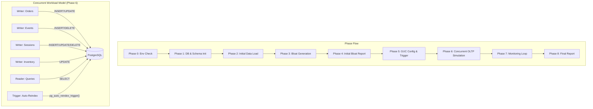

# pg_auto_reindex Test Design Document

## 1. Test Objectives
- **Correctness**: Ensure the extension correctly identifies bloated indexes, triggers `REINDEX CONCURRENTLY` without breaking the database, and records audit history accurately.
- **Stability**: Verify the background worker and EWMA (Exponentially Weighted Moving Average) learning mechanism remain stable under heavy, long-running concurrent OLTP workloads.
- **Effectiveness**: Prove that the automated reindex process effectively reclaims index space and reduces bloat while adhering to specified thresholds.

## 2. Test Architecture

### Architecture Diagram


## 3. Test Scenario Design

### 3.1 Unit Testing (`pg_auto_reindex.sql`)
The unit testing (regression test) focuses on the basic functionality of the extension:
- **Extension Installation**: Ensuring `CREATE EXTENSION pg_auto_reindex` runs cleanly.
- **GUC Defaults**: Verifying parameters like `enabled`, `min_bloat_ratio`, and `lock_timeout_ms`.
- **Function Callability**: Validating that all exposed functions (`pg_auto_reindex_stats()`, `pg_auto_reindex_status()`, `pg_auto_reindex_bloat_report()`, `pg_auto_reindex_trigger()`) return expected data structures.
- **Table & Index Creation**: Creating a test table, inserting data, checking if bloat reports generate correctly, and triggering a manual auto-reindex cycle.

### 3.2 Integration Testing (`production_simulation.sh`)
A comprehensive script that simulates a realistic production environment through 8 detailed phases:
- **Phase 0: Environment Check**: Validates tools, pg version, and extension availability.
- **Phase 1: Database & Schema Initialization**: Creates `auto_reindex_test` and sets up 4 business tables with 17 indexes.
- **Phase 2: Initial Data Load**: Populates tables with hundreds of thousands of rows to establish a size baseline.
- **Phase 3: Bloat Generation**: Artificially creates index bloat through multiple rounds of intensive UPDATEs and DELETEs.
- **Phase 4: Initial Bloat Report**: Evaluates bloat ratio and size before reindexing.
- **Phase 5: GUC Config & Manual Trigger**: Lowers the bloat threshold (`min_bloat_ratio=0.10`) and manually triggers reindexing.
- **Phase 6: Concurrent OLTP Simulation**: Launches 6 background processes (4 writers, 1 reader, 1 trigger) simulating a live database.
- **Phase 7: Monitoring Loop**: Continuously gathers metrics and logs them to a CSV file.
- **Phase 8: Final Report**: Aggregates final sizes, recovered space, success/failure counts, and EWMA statistics.

## 4. Business Table Model

To simulate realistic production scenarios, 4 distinct tables are modeled:

1. **`orders` (Order Table)**: High-frequency writes and status updates.
   - *Rationale*: Simulates typical e-commerce workloads. Indexes on `order_status` get heavily fragmented due to sequential state changes.
2. **`user_events` (User Behavior Log)**: High-frequency inserts and massive bulk deletes (log rotation).
   - *Rationale*: Massive DELETEs leave large gaps in B-Tree index pages, causing significant bloat. Includes a GIN index on a JSONB payload.
3. **`sessions` (Session Table)**: Frequent updates and expiration deletions.
   - *Rationale*: A high-churn table where rows are constantly replaced, leading to quick index degradation.
4. **`inventory` (Inventory Table)**: Extremely frequent UPDATEs.
   - *Rationale*: Mimics stock deduction. Frequent in-place updates cause standard B-Tree indexes to bloat rapidly.

## 5. Bloat Generation Strategy

Index bloat is generated deliberately over several configurable rounds (default: 5):
- **UPDATEs (orders, inventory)**: Modifying indexed columns forces PostgreSQL to insert new index tuples while leaving dead tuples behind, fragmenting index pages.
- **DELETE + INSERT (user_events, sessions)**: Deleting old records and inserting new ones with different keys causes the B-Tree to split pages, leaving sparsely populated pages that aren't easily reused.
- **Volume Rationale**: Tens of thousands of rows are modified per round to quickly inflate index sizes by gigabytes within minutes, ensuring the `min_bloat_ratio` threshold is breached.

## 6. Concurrent Workload Model

During Phase 6, the system runs 6 background processes to simulate an active database:

1. **Writer 1 (Orders)**: `INSERT` 500 rows, `UPDATE` 200 rows. (Interval: 2s)
2. **Writer 2 (Events)**: `INSERT` 1000 rows, `DELETE` 800 rows. (Interval: 3s)
3. **Writer 3 (Sessions)**: Expire old, `INSERT`/`UPSERT` 300 rows, `UPDATE` 200 rows. (Interval: 2s)
4. **Writer 4 (Inventory)**: `UPDATE` 500 rows. (Interval: 4s)
5. **Reader 1 (Queries)**: Executes analytical `COUNT` and `SUM` queries across tables to ensure concurrent `SELECT`s are not blocked by `REINDEX CONCURRENTLY`. (Interval: 1s)
6. **Trigger**: Calls `pg_auto_reindex_trigger()` every 60 seconds to ensure automated logic is repeatedly exercised.

## 7. Monitoring Metrics

The test script continually monitors the system and outputs to a CSV file (`monitor.log`).
- **Sampling Interval**: 15 seconds (default).
- **Metrics Collected**:
  - `iteration`: Current loop iteration.
  - `total_index_size_mb`: Overall size of public indexes.
  - `bloated_count`: Number of indexes exceeding the bloat threshold.
  - `reindexed_count`: Total successful reindex operations.
  - `bytes_saved`: Space reclaimed in bytes.
  - `is_idle`: Background worker idle status.
  - `load_avg`: EWMA tracked load average.
  - `active_backends`: EWMA tracked backend connections.
- **CSV Format**:
  `timestamp,iteration,total_index_size_mb,bloated_count,reindexed_count,bytes_saved,is_idle,load_avg,active_backends`

## 8. Acceptance Criteria

The simulation test is considered **PASSED** if:
1. The script completes without fatal PostgreSQL errors or connection drops.
2. `FINAL_REINDEX_COUNT > 0`: The automated system successfully identified bloated indexes and executed at least one successful reindex.
3. The `pg_auto_reindex_history` table correctly records space saved (`bytes_before` > `bytes_after`).
4. Read/Write workloads do not encounter extended locking errors caused by the reindex operations.

## 9. Configuration Recommendations

Depending on the testing goal, the script can be tuned:
- **Quick Test (CI/CD)**:
  `--duration 5 --bloat-rounds 3`
  *Use for quick validation of extension functionality.*
- **Deep Bloat Test**:
  `--duration 15 --bloat-rounds 10`
  *Generates severe bloat to test the limits of the space reclamation algorithm.*
- **Overnight Stability Test**:
  `--duration 720 --bloat-rounds 5`
  *Runs for 12 hours to fully test the 168-time-slot EWMA learning mechanism and identify potential memory leaks or long-term lock starvation.*

## 10. Usage Guide

The script is located at `test/production_simulation.sh`.

### CLI Arguments
- `--duration <minutes>`: Total runtime in minutes (default: 10)
- `--pgbin <path>`: Path to PostgreSQL `bin` directory
- `--port <port>`: PostgreSQL connection port (default: 5432)
- `--db <dbname>`: Database name for testing (default: `auto_reindex_test`)
- `--bloat-rounds <n>`: Number of artificial bloat cycles (default: 5)
- `--no-cleanup`: Do not drop the database after completion
- `--help`: Show help text

### Run Examples

**Basic run with defaults:**
```bash
./production_simulation.sh
```

**Custom port and 30-minute duration:**
```bash
./production_simulation.sh --port 5433 --duration 30
```

**Keep data after test for analysis:**
```bash
./production_simulation.sh --duration 20 --bloat-rounds 8 --no-cleanup
```
