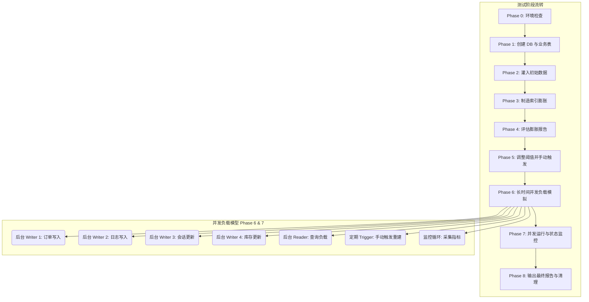

# pg_auto_reindex 测试设计文档

本文档详细说明了 `pg_auto_reindex` 扩展的测试设计，包括从基础单元回归测试到生产级别长时间并发负载模拟测试的全链路验证策略。

## 1. 测试目标

本测试体系的设计旨在验证 `pg_auto_reindex` 在各类负载下的表现：
- **正确性**：验证后台进程的启停机制、EWMA（指数加权移动平均）统计、膨胀率计算和索引重建命令是否符合预期。
- **稳定性**：确保在长时间、高并发的 OLTP 负载下，插件不会引发死锁、内存泄漏或影响数据库主进程的稳定性。
- **有效性**：验证自动索引重建策略能否准确识别膨胀过高的索引，并成功回收空间，从而在不干扰业务的情况下优化数据库性能。

## 2. 测试架构图

以下流程图展示了在生产级模拟测试中，各个阶段的流转以及后台负载进程之间的并发交互关系。



## 3. 测试场景设计

测试分为基础的单元回归测试与深度的集成模拟测试两大部分。

### 3.1 单元测试 (Regression Test)
位于 `sql/pg_auto_reindex.sql`，主要利用 PostgreSQL 原生的 `pg_regress` 框架：
- **扩展安装**：验证 `CREATE EXTENSION pg_auto_reindex;` 的正常执行。
- **GUC 默认值检查**：检查 `enabled`、`min_bloat_ratio` 和 `lock_timeout_ms` 等核心参数的默认配置。
- **函数可调用性**：调用并验证 `pg_auto_reindex_stats()` (应返回168条记录)、`pg_auto_reindex_status()` 和 `pg_auto_reindex_bloat_report()` 是否按预期工作。
- **表与索引创建及清理**：创建简单的测试表并制造少量数据，执行 `pg_auto_reindex_trigger()` 手动触发，并检查审计历史表 `pg_auto_reindex_history` 的写入。

### 3.2 集成测试 (production_simulation.sh)
集成测试模拟真实生产环境的长期运行状态，分为 8 个核心阶段：
- **Phase 0 (环境检查)**：检查 `psql` 可用性、PostgreSQL 版本以及插件是否已成功安装 (`make install`)。
- **Phase 1 (创建数据库和表)**：清理并重建专用测试库，安装插件，并建立 4 张典型的业务场景表及其配套的 17 个索引。
- **Phase 2 (灌入初始数据)**：大规模插入数万至数十万不等的初始记录，并执行 `ANALYZE` 建立基准统计信息。
- **Phase 3 (制造索引膨胀)**：通过多轮次的强力 UPDATE/DELETE/INSERT 组合拳，迫使 B-Tree 索引页面产生大量碎片。
- **Phase 4 (评估膨胀报告)**：调用 `pg_auto_reindex_bloat_report` 和统计函数，打印膨胀前的基准容量，验证膨胀检测逻辑的准确性。
- **Phase 5 (参数调整与预触发)**：将 `min_bloat_ratio` 调低至 0.10，确保后续轻度膨胀也能被清理，并执行一次手动 Trigger 进行连通性验证。
- **Phase 6 (长时间并发 OLTP 模拟)**：启动 6 个独立的后台子进程，同时对 4 张业务表进行高频读写，并定期触发 Reindex。
- **Phase 7 (监控循环)**：主脚本在测试期间持续轮询插件状态，收集系统负载、自动重建进度、已回收字节等数据并落盘至 CSV 日志。
- **Phase 8 (最终报告)**：汇总并对比初始与最终的索引容量，计算总体节省空间，并根据历史记录评估测试是否通过。

## 4. 业务表模型设计

在集成测试中，设计了 4 张具备不同读写特征的业务表，以全面覆盖数据库索引可能遭遇的物理膨胀场景：

1. **orders (订单表)**：
   - *模拟场景*：电商系统的核心交易数据，状态机频繁扭转。
   - *设计考量*：使用 `order_status` 等状态列。高频插入新订单，且原有订单的状态会被多次 `UPDATE`。导致多列组合索引和状态索引频繁分裂。
2. **user_events (用户行为日志)**：
   - *模拟场景*：前端埋点上报的日志信息，存在定期清理（日志轮转）机制。
   - *设计考量*：高频且大批量的 `INSERT`，配合大范围的过旧数据 `DELETE`。这类表的数据量会形成波峰波谷，导致索引空间出现大面积闲置的死元组空洞。
3. **sessions (会话表)**：
   - *模拟场景*：Web 服务的用户登录状态维持，生命周期短。
   - *设计考量*：主键或 Token 的快速生成与过期清理。不仅有针对 `last_active` 的频繁更新，还有按时间范围的集中式 `DELETE`，是制造严重膨胀的绝佳靶点。
4. **inventory (库存变动表)**：
   - *模拟场景*：仓储系统的库存扣减。
   - *设计考量*：同一行的 `quantity` 和 `reserved` 字段存在极高频度的原地 `UPDATE`。这种热点更新会大量产生表级别的死元组并迅速使索引页面产生页内碎片。

## 5. 膨胀制造策略

在 **Phase 3**，测试框架会执行指定轮次（默认5轮）的数据操作，特意为后续的自动重建制造靶标。每轮的策略如下：
- **组合策略 (UPDATE + DELETE/INSERT)**：
  - *orders* 随机选取 30,000 行更新状态和金额。迫使带有相关字段的索引生成新条目。
  - *user_events* 删除 40,000 行旧数据，插入 20,000 行新数据。产生净空间流失和索引空洞。
  - *sessions* 删除 15,000 行，插入 10,000 行。
  - *inventory* 随机选取 10,000 行高频更新数值字段。
- **设计依据**：这种规模的操作足以使得索引的页面碎片率（Bloat Ratio）在数分钟内快速攀升至 30% 甚至更高。分轮次执行可确保 VACUUM 介入时旧元组能被标记为可重用，进而更真实地模拟“表层面空间未涨，但索引层面严重碎片化”的生产现象。

## 6. 并发负载模型

为了验证 `pg_auto_reindex` 在高负载下的安全性和加锁机制（是否会引发锁超时或阻塞业务），设计了 6 个并行的后台进程，共同施加压力：

| 后台进程 | 目标表 | 频率 | 操作特性 |
| --- | --- | --- | --- |
| **Writer 1** | `orders` | 每 2 秒 | `INSERT` 500 行，`UPDATE` 200 行，模拟常规交易。 |
| **Writer 2** | `user_events` | 每 3 秒 | `INSERT` 1000 行，`DELETE` 800 行，模拟日志滚动。 |
| **Writer 3** | `sessions` | 每 2 秒 | 清理过期、插入 300 条、并发 `UPDATE` 200 条。 |
| **Writer 4** | `inventory` | 每 4 秒 | `UPDATE` 500 行，模拟热点库存扣减。 |
| **Reader** | 全局 | 每 1 秒 | 对所有 4 张表执行各种聚合和点查，模拟读查询。 |
| **Trigger** | 插件 API | 每 60 秒 | 调用 `pg_auto_reindex_trigger()` 手动激活 worker 工作流。 |

## 7. 监控指标体系

在并发压测期间，测试脚本会通过独立循环（Phase 7）定期（默认15秒）采集数据库和插件的内部状态，并输出到标准输出和 CSV 文件中：

**采集指标：**
- `TOTAL_IDX_SIZE_MB`：所有索引的总体积，观察空间膨胀和被回收的趋势。
- `BLOATED_COUNT`：当前超过阈值需要重建的索引数量。
- `REINDEXED_COUNT`：本次测试期间已完成重建的索引总数。
- `BYTES_SAVED`：通过重建历史计算出的已回收存储空间总字节数。
- `IS_IDLE`：当前后台 Worker 的运行状态。
- `LOAD_AVG` & `ACTIVE_BACKENDS`：通过 EWMA 视图获取的当前系统负载趋势。

**CSV 日志格式 (`monitor.log`)：**
```csv
timestamp,iteration,total_index_size_mb,bloated_count,reindexed_count,bytes_saved,is_idle,load_avg,active_backends
2026-08-10T09:30:00Z,1,145.23,4,0,0,true,0.15,5.2
```

## 8. 验证标准

测试结束后的 Phase 8 将汇总所有指标，并依据以下条件判定测试结果：
- **测试通过 (Pass)**：
  - `pg_auto_reindex_history` 表中必须存在至少一条成功执行的记录。
  - `FINAL_BYTES_SAVED` > 0（确实回收了空间）。
  - 在整个并发负载期间，所有业务进程 (Writers/Reader) 未发生异常崩溃退出，数据库服务稳定。
- **测试失败 (Fail)**：
  - 没有任何自动重建发生（可能是膨胀制造失败，或者被高负载的锁超时阻碍）。
  - 有重建历史，但状态大量呈现错误（如死锁失败或其他异常）。
  - 数据库或扩展的函数抛出不可恢复的内部错误（如段错误、严重内存泄漏等）。

## 9. 参数配置建议

通过不同的命令行参数可以适配不同的测试深度，建议如下：

- **快速验收测试 (Fast Validation)**：验证安装和核心逻辑，用于 CI/CD。
  - 命令：`./production_simulation.sh --duration 2 --bloat-rounds 2`
- **深度负载测试 (Deep Load Test)**：模拟常规业务高峰，观察 EWMA 和锁控制行为。
  - 命令：`./production_simulation.sh --duration 30 --bloat-rounds 5`
- **过夜稳定性测试 (Overnight Soak Test)**：验证是否有内存泄漏、统计数据溢出或长期运行带来的衰退问题。
  - 命令：`./production_simulation.sh --duration 480 --bloat-rounds 15 --no-cleanup`

## 10. 使用方法

**命令行参数说明：**
- `--duration <minutes>`: 并发负载总运行时长，默认为 10 分钟。
- `--pgbin <path>`: 指定 psql 命令所在目录。
- `--port <port>`: 数据库连接端口。
- `--db <dbname>`: 测试专用的数据库名。
- `--bloat-rounds <n>`: 初始化时制造膨胀的强度轮次，越大膨胀越严重。
- `--no-cleanup`: 测试结束后保留测试数据库（供后续手工排查）。
- `--help`: 打印帮助菜单。

**运行示例：**
```bash
# 默认配置下跑一轮 10 分钟的常规测试
./production_simulation.sh

# 指定 PostgreSQL 路径，运行 60 分钟并发负载并在结束后保留数据供分析
./production_simulation.sh --pgbin /usr/local/pgsql/bin --duration 60 --no-cleanup
```
